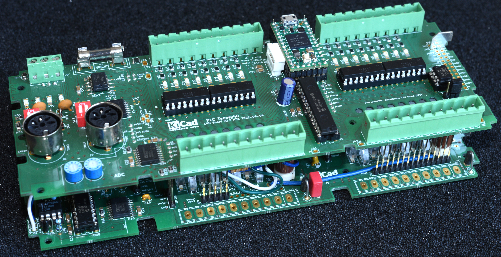

# myT40-PLC  (SPS) based on Teensy 4.0
Hardware for PLC based on Teensy 4.0, covering all my needs. I have to replace my 30 years old PS4-141-MM1 and PS4-341-MM1 from "Klöcker Moeller", reusing the original case of the model PS4-141-MM1.

Picture: Prototype V3

Motivation for a “Mighty 40”
----------------------------
Since the late 1990s, I have been working with four used PS4-141s, one PS4-341, both controllers from Klöckner Moeller, and about two dozen 24V AC surge relays (unfortunately not DC), commonly known as “Eltako,” I planned and developed my “smart home” in the late ’90s and installed it in my new house in 2002. 
The bus systems for building automation that were already on the market at the time were out of the question for me due to licensing issues and costs. 
These control units are networked and seamlessly integrated into my sub-distribution panels—commonly known as “fuse boxes”—on a circuit breaker (C) rail installed at the rear, just like standard circuit breakers. Circuit protection, power, and control are clearly separated in accordance with VDE standards.
Using serial communication, the master controller can be configured during operation using a user-friendly VB program (timer functions, lighting, roller shutters, light level detection, assignment of switches to power outlets such as wall sockets or ceiling outlets for lamps, etc.).
Since these controllers or similar devices are no longer manufactured in this format, the first failures occurred after nearly 30 years of trouble-free operation, and no other manufacturer offers affordable controllers with galvanic isolation(!) in this format anymore, I decided to strip down the PS4-141 housings and develop a new circuit that handles the most important functions and fits into these very housings I have on hand, hereinafter referred to as the “original housing.”

This is not intended to be a replica of the original, nor is that the goal. Externally, the case has been noticeably modified and fitted with different connectors: the “myT40-PLC”.
Since the circuit itself might also be of interest to others, I designed the main board in two versions for J3: one with an FFC connector, the “FFC” version, for my personal replacement in the original case, and a standard version with a pin header, the “PFS” version, to inspire replicas in any case. The latter is presented here.

This pin header connector "PFS" version offers a 2x DAC option and a 2x ADC option, while allowing the use of all 32 digital I/O channels and providing Sub-D connectors for bus systems in a separate housing. This distinguishes it from the FFC version, which cannot optionally provide all outputs when the DAC and ADC are installed and connected.

A parallel project, myT41-Controller, focuses on a controller unit that provides a graphical interface, Ethernet, CAN and RS485 buses, as well as a serial OTA interface, and allows the myT40 PLC to be controlled, logged, and configured.
With appropriate programming, the myT41C controller can also be used as a protocol converter or logger on the interfaces for entirely different projects.

The software will be documented separately at a later date.
This document describes only the hardware-related port definitions that result from the circuit and are essential for programming.

Attended documents describe the "Final Version V5" as "V3.2 M43", based on experience of 4 prototypes build up in the past 5 years.

The current Version is the final one waiting to be build-up: V5.
I made a lot of changes and enhancements and transfered these features as well to the myT41-Controller.

myT40-PLC      Requirements for my new PLC
------------------------------------------
Even though the new circuit cannot meet all the requirements of the original, I still have a clear idea of what it will be capable of.
The new controller should

1. be installed in my existing original enclosures or any other enclosures,
2. be networked so it can communicate with other devices,
3. ensure isolated potentials for inputs, load circuits, bus systems, ADC/DAC, and controllers; therefore, commercially available Arduino- or Raspberry Pi-based PLCs are out of the question,
4. provide 16 digital inputs and 16 digital outputs as needed, with isolated potentials,
5. support interrupts for input bytes,
6. Provide 4 analog-to-digital converter inputs if required, two of these are fed via built-in setpoint potentiometers,
7. Provide 2 digital-to-analog converter outputs if required,
8. Process analog signals from 0..10V, ADC and DAC, with their own reference potential,
9. Support up to two CAN buses, galvanically isolated, optionally GND, PE shield via capacitor,
10. Provide an RS485 interface for 16 clients, galvanically isolated, bus termination with low-drop diodes or optionally classically with switchable terminating resistor 720/120/720 ,
11. RS485 connection corresponds to the original (V5); the DIN sockets combine CAN1/2 and RS485,
12. be based on a modern, fast processor with sufficient RAM,
13. be supported by an EEPROM/Flash memory,
14. have ICs mounted on sockets wherever possible,
15. support a mode selector switch with 3 modes, including a setting for a cold start via RESET,
16. be able to use the existing RESET button,
17. be able to trigger a RESET via software, including a choice between cold or warm start,
18. ensure local communication via SPI for the interface and function modules,
19. be energy-efficient and operate at 3.3V,
20. be programmed in C or C++,
21. allow communication with a PC or a control unit via CAN, RS485, Ethernet,
22. enable flexible programming,
23. feature a pluggable, wired 3.6V backup lithium battery with its own ADC monitoring,
24. Respond to the 24V AC “Eltako” devices present in the building’s electrical system with 5ms DC pulses (!),
25. Monitor the supply voltages of the CPU and the direct interfaces and, if necessary, perform a warm start or cold start with a reset,     
26. Control the onboard hardware watchdog and/or software watchdog in combination with the operating mode switch, or allow them to function independently.
27. Does not support flexible docking of various original expansion modules; however, a suitable connection panel for SPI and digital I/O is available, though it is incompatible with original expansion modules. Instead, equip the existing 16-channel digital output unit with a new “header board” to make	it usable.
28. No online programming or programming via network, although this might actually be possible.
29. No PWM support on the outputs or counter features on the inputs.
30. External hardware watchdog with adjustable times, including a definable delay on RESET and restart (V5),
31. Buttons for Teensy 4.0 boot/program and on/off (V5),
32. OTA option (V5).
	
	

Current developement
---------------------
Now that the Prototype 4 (V4) is working successfully with a 4-layer PCB, I have added an external watchdog and a delay to Version 5.
It offers optionally the use of OTA via one of the two serial interfaces instead of a second CAN bus.
However, Version 5 has not yet been built or tested. That is planned for the coming months.

There are some things to do like translation of documentation into English or Spanish, perhaps in next winter.
The current documentation is in German. 
So please be pacient, feel free and be inspired.

(Text partially translated with deepl.com)

Licence
---------------------
This work is licensed under the Creatjve Commons Atuributjon-NonCommercial-ShareAlike 4.0 Internatjonal
License. To view a copy of this license, visit htup://creatjvecommons.org/licenses/by-nc-sa/4.0/ or send a
letuer to Creatjve Commons, PO Box 1866, Mountain View, CA 94042, USA.
This license lets others remix, adapt, and build upon your work non-commercially, as long as they credit you
and license their new creatjons under the identjcal terms.
htup://creatjvecommons.org/licenses/by-nc-sa/4.0/

  Title    myT40-PLC Documentation

  Author   Clemens Niesen, Germany, 2026

  Source   These documents

  Licence  CC-BY-NC-SA

DISCLAIMER
----------

I explicitly state that I make no representations or warranties regarding non-infringement or the absence of other defects with respect to the CC-licensed work.This means that users use the work at their own risk.

Furthermore, I point out that this project and the content of this documentation, as well as associated files, is purely a recreational project and should be understood as a case study for the reader. 

This project, these circuits are not tested or approved by official bodies. Errors can not be excluded despite all care. Whoever reproduces this project does so at his own risk and responsibility. I do not take any responsibility for damages to persons and devices, material, buildings, animals, etc..

Rebuilding is reserved exclusively for experienced people who know exactly what they are doing.  What third-party use of the control with third does and does not, lies apart from the craftsmanship of the construction also with the software, which is also beyond my responsibility. I give no guarantee and take no responsibility for the content of references, links and quotes.
